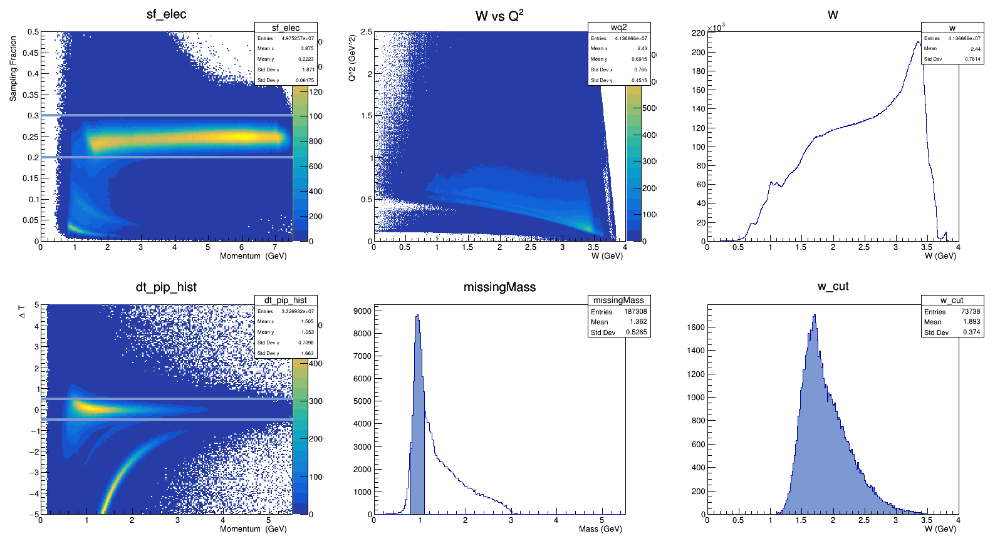

# hipoTests

## Build

To build, must have a version of coatjava and environment variable CLAS12LIBS set to the path of coatjava.

```bash
export CLAS12LIBS=/path/to/dir/containing/coatjava
mkdir build && cd build
cmake ..
make
```

This will build the jar file for hipo3test/hipo4test as well as the rootTest.

## Test setup

| Computer/software for testing           	|
|-----------------------------------------	|
| Ubuntu 17.10                            	|
| openjdk version "1.8.0_171"             	|
| coat-libs-5.7.7-SNAPSHOT.jar            	|
| ROOT 6.17/01                            	|
| gcc (Ubuntu 7.2.0-8ubuntu3.2) 7.2.0     	|
| Intel(R) Core(TM) i7-3770 CPU @ 3.40GHz 	|
| 4 Cores/8 Threads                       	|
| HDD (3TB/7200rpm)                       	|
| SSD (128GB)                             	|


## Getting the root files
Files were converted with dst2root_3 which can be found and built using the [hipo_tools](https://github.com/JeffersonLab/hipo_tools) package.

They can also be converted with:

```bash
docker run --rm -it -v $PWD:/data tylern4/hipo_tools dst2root_3 /data/file.hipo
```

Where file.hipo is in the current folder.
Make sure to append '/data/' to the file so that docker can find the file and convert it.


| Conversion test 	| Time     	  | Events/Sec 	| kHz      	|
|-----------------	|----------	  |------------	|----------	|
| HDD (hipo3)     	| 32.4 Sec 	  | 3228.4 Hz  	| ~ 3.2 kHz |
| SSD (hipo3)     	| 31.7 Sec 	  | 3305.2 Hz  	| ~ 3.3 kHz	|
| SSD (hipo3/skim)  | 1258.7 Sec 	| 5702.5 Hz   | ~ 5.7 kHz |


## Running Tests

To run java tests:
```bash
java -cp "hipo3test.jar:$CLAS12LIBS/*" hipo3test "/path/to/hipo3/files/*.hipo" beam_energy
```

```bash
./rootTest "/path/to/dst2root/files/*.root" beam_energy
```

## Analysis and Results

This test is a naive first step approach to an analysis of e + p-> e + pip + N. The logic of all the programs is:

```python
events = read.files("/path/to/multiple/files/*")

while events in files:
  # Make sure there are reconstructed events if not continue
  if (length(pid) == 0) continue;
  # If the first particle is not negative continue
  if (charge(0) != -1) continue;

  # calculate and fill Sampling Fraction
  Sampling_fraction = calculate(Sampling_fraction)
  Sampling_fraction_hist.Fill(momentum, Sampling_fraction)

  # Cut on Sampling_fraction to get good electrons
  if (Sampling_fraction < 0.2 or Sampling_fraction > 0.3) continue;

  # calculate and fill W and W vs Q2 hists
  wq2.Fill(W_calc(e_mu_prime), Q2_calc(e_mu_prime))
  w.Fill(W_calc(e_mu_prime))

  # get vertex time from electron
  e_vertex = vertex_time(sc_ftof_1b_time(0), sc_ftof_1b_path(0), 1.0)

  # Make Pi Plus vector
  pionP = new TLorentzVector()

  # Add counts so that we can check only one Pi Plus was detected in the event
  numpip = 0
  numOther = 0
  # Loop over all the particle in the event
  for part in range(1, length(pid)):
    pionP.SetXYZM(px.(part), py.(part), pz.(part), MASS_PIP);

    pip_dt = NAN;
    # If the charge is positive calculate delta T assuming the mass of a Pi Plus
    if charge(part) == 1)
      sc_t = sc_ftof_1b_time(part)
      sc_r = sc_ftof_1b_path(part)
      pip_dt = delta_t_calc(e_vertex, p(part), sc_t, sc_r, MASS_PIP)
      dt_pip_hist.Fill(p(part), pip_dt)

    # Add one to the numpip if canidate Pi Plus is found else count
    if abs(pip_dt) < 0.5 and charge(part) == 1:
      numpip += 1;
    else
      numOther += 1;

  # If single Pi Plus found, fill in missing mass histogram and cut between 0.8 and 1.1 to get the desired reaction channel
  if numpip == 1 and numOther == 0:
    missingMass.Fill(missM(e_mu_prime, pionP))
    w_mm.Fill(W_calc(e_mu_prime), missM(e_mu_prime, pionP))
    if (missM(e_mu_prime, pionP) >= 0.8 and missM(e_mu_prime, pionP) <= 1.1)
      missingMass_cut.Fill(missM(e_mu_prime, pionP))
      w_cut.Fill(W_calc(e_mu_prime))
```

#### Root Output



#### Hipo Output


## hipo3 Results

Files originally from /work/clas12/clas12/data/calib/cooked_5p7p4_fullMap
All files from run 5700 copied to local computer for testing.


All files, on HDD:

|    Test   	| File Size 	|  Events processed 	|   Time (sec)   	| Events/Sec (Hz) 	|   kHz   	|
|:---------:	|:---------:	|:-----------------:	|:--------------:	|:---------------:	|:-------:	|
| hipo3test 	|   1.3TB   	| 49,252,490 Events 	| 13,465.422 Sec 	|    3,657.7 Hz   	|  ~ 4kHz 	|
|  rootTest 	|   136GB   	| 49,752,570 Events 	|  3,727.85 sec  	|   13,346.2 Hz   	| ~ 13kHz 	|


Selection of 50 files, on SSD:

|    Test   	        | File Size 	| Events processed 	| Time (sec) 	| Events/Sec (Hz) 	|   kHz   	|
|:------------------:	|:---------:	|:----------------:	|:----------:	|:---------------:	|:-------:	|
| hipo3test 	        |    80GB   	| 3,041,806 Events 	| 644.25 Sec 	|    4,721.5 Hz   	|  ~ 5kHz 	|
| hipo3test (1 core)	|    80GB   	| 3,041,806 Events 	| 865.46 Sec 	|    3,514.7 Hz   	|  ~ 4kHz 	|
|  rootTest 	        |   8.5GB   	| 3,072,249 Events 	| 160.1 sec 	|   19,573.5 Hz   	| ~ 20kHz 	|

Skimmed file for run 4013:

|    Test   	        | File Size 	| Events processed 	| Time (sec) 	| Events/Sec (Hz) 	|   kHz   	|
|:------------------:	|:---------:	|:----------------:	|:----------:	|:---------------:	|:-------:	|
| hipo3test 	        |    14GB   	| 7,176,505 Events 	| 321.9 Sec 	|   30,950.8 Hz   	|  ~ 31kHz 	|
| hipo3test (1 core)	|    14GB   	| 7,176,505 Events 	| 345.3 Sec 	|   20,784.6 Hz   	|  ~ 21kHz 	|
|  rootTest 	        |    13GB     | 7,176,506 Events 	| 205.9 sec 	|   34,838.8 Hz   	|  ~ 35kHz 	|


Java examples were using over 100% of the cpu (ie. multiple java threads) so tests were re-run using taskset for the 1 core results.

## hipo4 Results

Currently inconclusive since there is only one file to test.

```
/work/clas12/jnp/clas_004152.recon.hipo
```

The file tested is also strange hipo in java says 1,253,842 events while the max events processed is 255,341 which is only 20% of the file. An event is only counted if the first particle is negative and therefore goes through some processing/histogram filling, the programs do not count events which are skipped.

The files were converted using the same program but with different options. The first option saves all events in the file, the second option only saves events where the length of the reconstructed events is not 0, while the third option only saves events with a good identified electron as the first particle.

| Conversion test           	| Time      	| Events/Sec 	  | kHz     	 |
|---------------------------	|-----------	|------------	  |---------	 |
| SSD (hipo4) (all events)  	| 584.2 Sec 	| 2,146.4 Hz  	| ~ 2.1 kHz  |
| SSD (hipo4) (rec events)  	| 435.2 Sec 	| 2,880.6 Hz  	| ~ 3 kHz  	 |
| SSD (hipo4) (elec events) 	| 41.4 Sec  	| 2,696.2 Hz 	  | ~ 2.6 kHz  |

Since the root file format is the same in both hipo3/hipo4 conversion the Events/Sec should be close to the same when reading a converted hipo3/hipo4 file however this is not the case. It would be better comparison to look at hipo3/hipo4 files for the same run but I only have one file available for hipo4 testing and cannot find the hipo3 files for the same run.

|          Test          	| File Size 	| Events Processed 	| Time (sec) 	| Events/Sec (Hz) 	|  kHz  	|
|:----------------------:	|:---------:	|:----------------:	|:----------:	|:---------------:	|:-----:	|
|        hipo4Test       	|   2.2GB   	|      255,341     	|  12.3 Sec 	|    20,722 Hz      | ~ 21 kHz  |
|  rootTest (all events) 	|   2.3GB   	|      255,341     	|  32.1 Sec  	|    7952.3 Hz    	| ~ 8 kHz   |
|  rootTest (rec events) 	|   2.3GB   	|      255,341     	|  24.5 Sec  	|    10,398.7 Hz    | ~ 10 kHz	|
| rootTest (elec events) 	|   204MB   	|      111,543     	|  2.38 Sec  	|    46,791.7 Hz    | ~ 47 kHz	|
